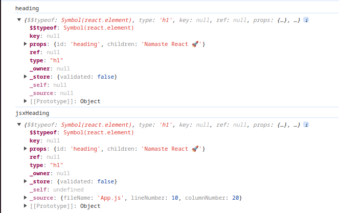

## Write script to start the project
- Use the package.json to start the project.
- This is a industry standard.
- Therefore, in any new project to find the commands check the package.json and find the scripts key.
- Create two scripts `start` & `build` and write the commands.
- Updated package.json:
```
"scripts": {
    "start": "parcel index.html",
    "build": "parcel build index.html",
    "test": "jest"
  },
```
- Command (Development build and local server)
```
npm run start
```
- Command (Production build)
```
npm run build
```
- Shorthand for `npm run start` is `npm start`. This shorthand is not valid of other commands.

## Foundations
- Delete everything from App.js.
- There are React elements which are like to DOM elements but not equivalent.
- React elements are Objects while DOM elements are HTML.
- React Element:
```
React.createElement("h1", { "id": "heading"}, "Namaste React 🚀");
```
- HTML Element:
```
<h1 id="heading">Namaste React 🚀</h1>
```
- React Element > Object > HTML Element (render)
- There is a common practice to display `Not Rendered` on the HTML, in-case React code doesn't work.

## JSX
- `React.createElement` can make the code clumsy.
- To make the code clean JSX was used in React.
- JSX is seprate from React, it is not a part of React.
- Frameworks like React tries to merge all the files viz. Markup files, logic etc.

## Create heading (JSX)
- JSX is not HTML inside Javascript.
- JSX is a HTML-like or XML-like syntax.
- Command:
```
const jsxHeading = <h1>Namaste React using JSX.</h1>;
```
- Elements created using `JSX` is equivalent to elements created using `React.createElement`.
- `console.log` of `JSX` & `React.createElement`
- 
- Therefore, JSX is just an optimized syntax to write React elements.
- JSX is not pure javascript.
- JS Engine does not understand the JSX.
- JS Engine understands ECMAScript.
- To render JSX code, under the hood **parcel** is `transpiling` the code.
- Transpile means to convert the code before it reaches JS Engine.
- Parcel also does not do it itself. Parcel is just a manager.
- It uses a package named `Babel`.

## Babel
- JS compiler and transpiler
- `JSX` => Babel transpiles to core React i.e. `React.createElement` => ReactElement-JS Object => HTMLElement(render)
- Apart from this Babel also converts older JS code to ES6 etc.
- Read docs
- Babel reads the code one-by-one.
- It creates an AST (Abstract Syntax Tree).
- Attributes in the JSX are given in **camelCase**.
- Example:
- class in HTML element: `class="root"`
- class in JSX element: `className="root"`

## Single line vs. Multi-line JSX
- Single line JSX is valid.
- Multi line JSX require parenthesis wrapper.
- Because Babel need to understand the start and end of JSX code.

## Assignment
- Explore various attributes of various tags
- Anchor tags
- Image tag
etc.


## VSCode extensions
- Prettier
- Bracket Pair colorizer
- ES Lint
- Better comments

## React Components
- Everything is a component in React.
- There are two types of components in React:
    - Class Components (Old)
    - Functional Components (New)
- _A **React Functional Component** is a Javascript function that returns a **React Element**._
- A React Element is equivalent to JSX.
- Therefore, _A **React Functional Component** is a Javascript function that returns a **React Element** or **JSX**._
- **Note:** A React Functional Component must start with a capital letter.
- If you create a React Functional Component starting with a small letter, the Component will not get rendered. Also a warning will be shown.
```
Warning: The tag <test> is unrecognized in this browser. If you meant to render a React component, start its name with an uppercase letter.
    at test
    at div
    at ComponentComposition
```
- A Heading Component (Single line)
```
const HeadingComponent = () => {
    return <h1 id="heading">Namaste React Functional Component</h1>
};
```
- A Heading Component (Shorthand)
```
const HeadingComponent = () => <h1 id="heading">Namaste React Functional Component using Shorthand</h1>;
```
- A Heading Component (Multi line)
```
const HeadingComponent = () => (
    <div id="container">
        <h1 className="heading">Namaste React Functional Component</h1>
    </div>
);
```

## Render React Functional Components
- To render components just put the components in a **self closing tag**.
- Render a component:
```
const HeadingComponent = () => (
    <div id="container">
        <h1 className="heading">Namaste React Functional Component</h1>
    </div>
);

const root = ReactDOM.createRoot(document.createElementById("root"));

// render a component
root.render(<HeadingComponent />);
```
- You can also use like regular HTML tags i.e. `<HeadingComponent></HeadingComponent>`

## Component Composition
- **Component Composition** means using two or more React Components together.
- Using one React Component inside another React Component.
- Component Composition Example:
```
const Title = () => (
    <h1 className="head" tabIndex="5">
        Namaste React using JSX 🚀
    </h1>
);

const HeadingComponent = () => (
    <div id="container">
        <Title /> // A React Component used in another React Component
        <h1 className="heading">Namaste Component Composition 🚀</h1>
    </div>
);
```
- The `<Title />` will be replaced by its code.
- Output:
```
<div id="container">
    <h1 class="head" tabindex="5">Namaste React using JSX 🚀</h1>
    <h1 class="heading">Namaste React Component Composition 🚀</h1>
</div>
```

## JS in JSX
- You can run any Javascript code inside JSX by using a curly braces.
- Expressions, variables, `console.log` etc.
- You can even render the React Components created in a normal variable.
- You can do a mix and match of the React Components inside one another.
- You can use this way to debug also.
- **Note:** Semi-colon will throw an error as it would not be able to transpile it.
- It sanitizes the data you put inside. It prevents **Cross-site scripting** attacks.
- You can also execute Javscript functions inside these curly braces.
- Example (Variable inside Component):
```
const myVariable = 1000;

const HeadingComponent = () => (
    <div id="container">
        <Title />
        {myVariable}
        <h1 className="heading">Namaste Component Composition 🚀</h1>
    </div>
);
```
- Example (Expression inside Component):
```
const HeadingComponent = () => (
    <div id="container">
        <Title />
        {100 + 200}
        <h1 className="heading">Namaste Component Composition 🚀</h1>
    </div>
);
```
- Example (console.log inside Component):
```
const HeadingComponent = () => (
    <div id="container">
        <Title />
        {console.log("debug")}
        <h1 className="heading">Namaste Component Composition 🚀</h1>
    </div>
);
```
- Example (Variable inside Component):
```
const title = (
    <h1 className="head" tabIndex="5">
        Namaste React using JSX 🚀
    </h1>
);

const HeadingComponent = () => (
    <div id="container">
        <Title />
        {title}
        <h1 className="heading">Namaste Component Composition 🚀</h1>
    </div>
);
```
- Example (Function inside Component):
```
const title = function () {
    return (<h1 className="head" tabIndex="5">
        Namaste React using JSX 🚀
    </h1>)
};

const HeadingComponent = () => (
    <div id="container">
        <Title />
        {title()}
        <h1 className="heading">Namaste Component Composition 🚀</h1>
    </div>
);
```
