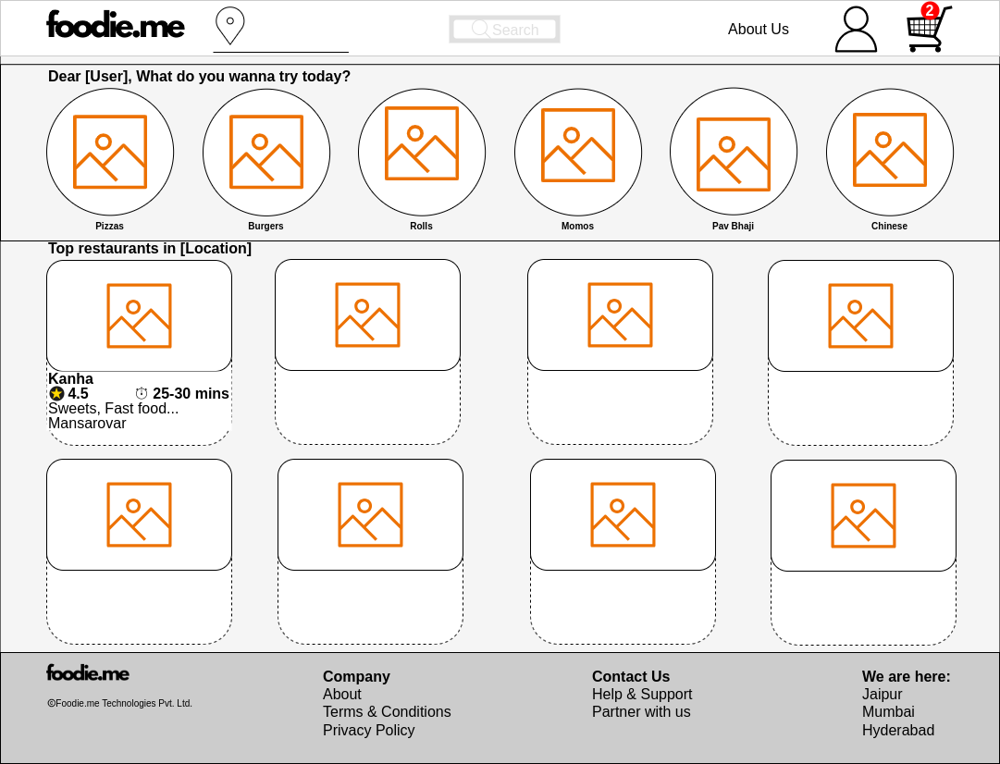
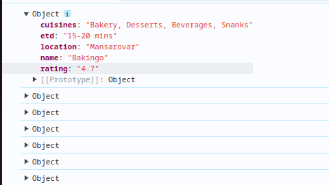
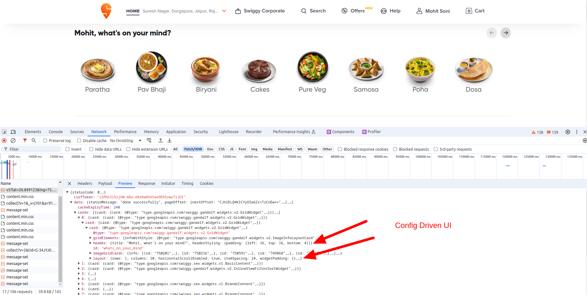
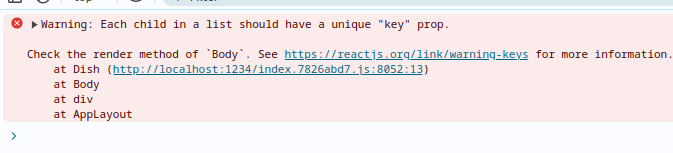

## Steps to build a production ready app

- First step to build any application should be **Planning**.
- Planning is important and mandatory.
- Step 1: Create rough mockups or wireframe
  - Mockups are rough sketches which show a basic layout of your app.
  - Purpose of wireframe is to know the exact placement of components before starting to code.
- Step 2: Once basic wireframe is ready, try to identify components which should be created to build the proposed wireframe.
  - Generally there will be major 3 components viz. Header, Body and Footer.
  - Everything will be inside either of these three components.
- Components:
  - App
    - Header
      - Logo
      - CustomerLocation
      - Search
      - NavBar
        - NavItems
        - UserIcon
        - Cart
    - Body
      - DishIntro
      - DishContainer
        - DishCard
      - RestaurantIntro
      - RestaurantContainer
        - RestaurantCard
    - Footer
      - MiniLogo
      - Copyright
      - Address
      - ContactUs
      - ServiceLocations
- Mockup
  
- We need to create the various components and use the Component composition to structure the app.
- You can give style to components by targeting classes of the components or you can also use inline style tag.
  - The inline style tag expects a javascript object.
  - Provide inline css in an attribute named **style**.
  - You need to give double-curly-brases.
  - The outer curly brases indicates that a Javascript code is expected.
  - Inner curly brases indicates the actual JSON.
  - **Note:** Inline styles are not recommended.
  - Example:

```
const RestaurantCard = () => {
    return (
        <div className="restaurant-card" style={ {
            backgroundColor: "#ddd"
        } }></div>
    );
}
```

## Props: How to insert data in the React component dynamically?

- You can insert dynamic data in React components using **props**.
- **props** means properties.
- **props** are just arguments to a function.
  > **Functional components** are basically a Javascript **functions** that return **JSX** code. Arguments to that function are **props**.

## How to pass data to the props?

- To pass any data to the React components, you can pass as **attributes** to the React Component tag.
- These are similar to style attribute or className attribute which we give in div.
- To capture it in the component, create a function argument in the React component.
- Example:

```
// Component
const Restaurant = (props) => {
    console.log(props);
    return (
        <div className="restaurant">
            <div className="restaurant-image-container">
                
            </div>
            <div className="restaurant-info">
                <p><strong>Bakingo</strong></p>
                <span className="star-and-timing"><FontAwesomeIcon icon={faStar} className="star" /><strong>4.7 | 15-20 mins</strong></span>
                <p>Bakery, Desserts, Beverages, Snacks</p>
                <p>Mansarovar</p>
            </div>
        </div>)
}
```

- Using component

```
<div className="restaurant-container">
    <Restaurant name="Bakingo" rating="4.7" etd="15-20 mins" cuisines="Bakery, Desserts, Beverages, Snanks" location="Mansarovar"/>
</div>
```

- Props (`console.log`)
  
- The **Props** will be a Javascript Object.
- Now you can use it inside the React component by simply using brases, for example `props.name`.
- You can also destructure on the fly.

## How does the data come in real-world?

- In real-world, your data comes from APIs.
- Generally API responses are in JSON format.
- Data is always in a complicated structure i.e. the data you want to display will be very hard to extract.
- The reason of this complex data is **Config Driven UI**.
- A Frontend engineer should be capable of discussing the structure of data with Backend engineers.

## What is Config Driven UI?

- Config-driven UI is a design pattern.
- According to it, the structure and behavior of the UI are **not hardcoded** in the application.
- Rather are determined by external configuration files or settings.
- This approach allows both developers and non-developers to modify UI layout, components etc. by simply adjusting config files wihtout code.
- ### Key Characterstics:
  - **Separation of Concerns**
    - UI is separated from actual implementation.
    - More modular
    - Easier to maintain
  - **Flexibility**
    - UI can be changed using configuration
    - No need to redeploy
  - **Customization**
    - Different UI for different environment, users or used cases by simply modifying config files.
  - **Scalability**
    - Scalabale because easy adjustment and expansion of UI without code.
- ### Common used casesL

  - Form builders
  - Dynamic dashboards
  - Theme customization

- A Config Driven UI is a concept to create dynamic UI conditinally.
- Requirement: When you want to show different offers or designs in different locations dynamically you need to build **Config Driven UI**.
- The website is driven by data or Config.
- Code once and then data automatically changes the UI.
- Example
- 

## Let's use real data

- Copy the real Swiggy API response in variable.
- Pass the entire API response in the React component and use it in the function.
- Extract the Food Data and Restaurant Data from the API response.
- Use the dynamic data received from the API response.
- You can use Javscript destructuring to simplify the data.
- **Note:** The real data is serving the images via CDN named `Cloudinary`.
- **Note:** The cards should be **reusable** i.e. if different data is passed to it then it should be able to render it.

## Good coding practices

- **Destructure data:** It is always better to destructure your data properly.
- **Optional chaining:** It is always safer to use to avoid unexpected errors.
- **Map, Reduce, Filter:** It is better to use functional programming React as there will be simple data transformations. - Use Map over loop if you want to **transform & return** new Array. - Use Map over loop to keep the original Array immutable. - Use Map over loop to improve readability. - Use loop over Map if a slight performance improvement matters. - Use loop over Map if complex transformations, logging etc. are to be performed.
  Example:

```
// Bad practice
const { restaurantInfo } = props;

<div className="restaurant">
    <div className="restaurant-info">
        <p>{restaurantInfo.name}</p>
        <p>{restaurantInfo.locality}</p>
    </div>
</div>

// Good practice
const { restaurantInfo } = props;

// destructure data
    const {
        name,
        avgRating,
        sla,
        cuisines,
        locality,
        cloudinaryImageId
    } = restaurantInfo?.info;

<div className="restaurant">
    <div className="restaurant-info">
        <p>{name}</p>
        <p>{locality}</p>
    </div>
</div>
```

- After applying loop or map you will see following Warning
  - Warning says that by applying a loop similar components are created in the DOM.
  - React expects a unique value in a `key` attribute in repetitive components.
  - **Note:** Whenever you are looping over and creating a React component, you need to provide a unique value in the `key` attribute of the returned JSX.
  - Why does React require a key attribute?
    - React optimizes its render cycles for the same level components.
    - If there is no unique id then whenever a new data element comes in the API response, all the repetitive components are re-rendered again.
    - But if a unique id is present then React will render only the new element and will not re-render the already rendered elements.
    - Re-rendering is a big performace hit.
    - **Note:** Never use loop index as unique identifier i.e. `key` because it negatively impact the performance and may cause issues. (TODO: Mentioned in React official documentation)
    - Use index as a last option.


```
<div className="restaurant-container">
    {restaurantData?.card?.card?.gridElements?.infoWithStyle?.restaurants.map(
        restaurant => <Restaurant restaurantInfo={restaurant} key={restaurant?.info?.id} />
    )};
</div>
```
